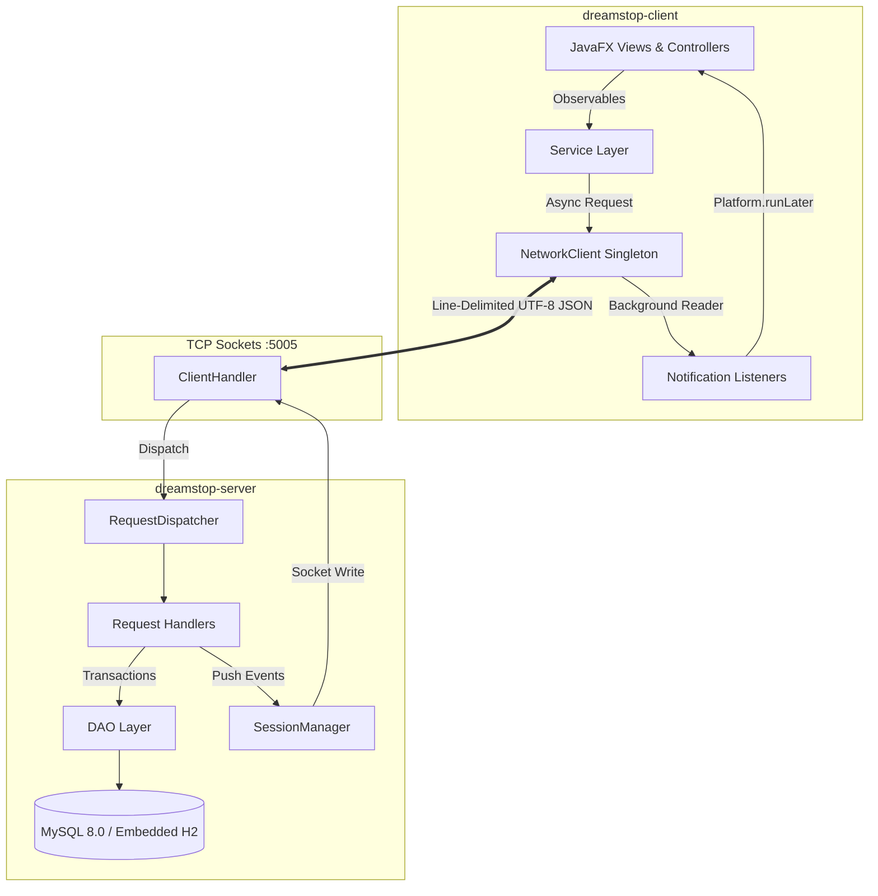
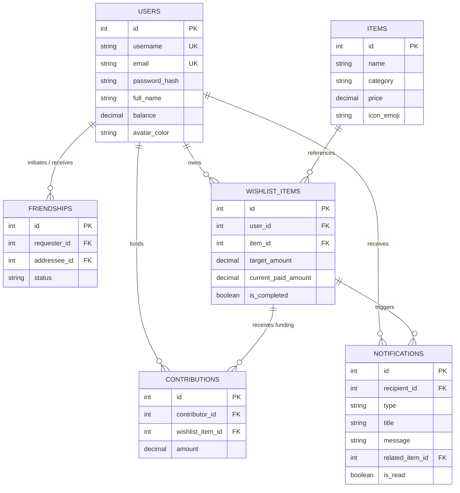

# Technical Architecture & System Design 🏛️

This document details the architectural decisions, module boundaries, network communication protocols, database schema, and concurrency model implemented in **DreamsTop (i-Wish)**.

---

## 1. Architectural Principles

DreamsTop adheres to classic distributed client-server patterns with strict separation of concerns:
- **Modular Monorepo**: Separates domain contracts (`common`), server infrastructure (`server`), and presentation (`client`) into distinct Maven modules.
- **Contract-First Protocol**: All network interactions exchange strongly-typed DTOs serialized into line-delimited UTF-8 JSON.
- **Zero-Config Resilience**: The server dynamically detects database availability; if a dedicated MySQL instance is offline, it automatically provisions an embedded in-memory H2 database.
- **Thread Isolation**: The client UI thread (JavaFX Application Thread) never blocks on I/O. All network operations return asynchronous `CompletableFuture` promises.



---

## 2. Module Boundaries & Responsibilities

| Module | Target Runtime | Dependencies | Primary Responsibility |
| :--- | :---: | :---: | :--- |
| **`dreamstop-parent`** | Maven POM | None | Dependency convergence, plugin management, and project-wide compiler configuration. |
| **`dreamstop-common`** | Java 11 bytecode | `gson` | Shared domain models, DTOs, protocol wrappers (`Request`, `Response`, `ServerNotification`), and `JsonUtils`. |
| **`dreamstop-server`** | Java 21 | `common`, `mysql-connector-j`, `h2`, `javafx-controls` | TCP socket daemon, multi-threaded request processing, DAO persistence, and GUI admin controls. |
| **`dreamstop-client`** | Java 21 | `common`, `javafx-controls`, `javafx-fxml`, `gson` | JavaFX desktop GUI, asynchronous networking, state management, and real-time toast notifications. |

---

## 3. Network Protocol Specification

Communication occurs over persistent raw TCP sockets using **line-delimited UTF-8 JSON framing** (`\n` termination). Each frame is an independent, complete JSON object.

### 3.1 Message Envelopes

#### A. Client-to-Server Request Envelope
```json
{
  "requestId": "550e8400-e29b-41d4-a716-446655440000",
  "type": "CONTRIBUTE",
  "sessionToken": "usr-2-1726845600",
  "payload": {
    "wishlistItemId": 1,
    "amount": 500.00
  }
}
```

#### B. Server-to-Client Response Envelope
```json
{
  "requestId": "550e8400-e29b-41d4-a716-446655440000",
  "status": "SUCCESS",
  "message": "Contribution processed successfully",
  "dataJson": "{\"acceptedAmount\":500.00,\"refundedAmount\":0.00,\"itemCompleted\":true}"
}
```

#### C. Server-to-Client Push Notification (Unsolicited)
```json
{
  "type": "ITEM_COMPLETED_RECEIVER",
  "title": "Gift Goal Reached!",
  "message": "Your wishlist item has been 100% fully funded!",
  "relatedItemId": 1,
  "timestamp": "2026-09-20T17:30:00"
}
```

### 3.2 Supported Request Actions

| Request Type | Payload Expected | Success Response Data | Description |
| :--- | :--- | :--- | :--- |
| `LOGIN` | `LoginRequestDTO` | `AuthResultDTO` | Authenticates user; returns session token & profile. |
| `REGISTER` | `RegisterRequestDTO` | `AuthResultDTO` | Registers account with initial balance & returns session. |
| `GET_CATALOG_ITEMS` | `null` | `List<ItemDTO>` | Retrieves global store catalog items. |
| `GET_MY_WISHLIST` | `null` | `List<WishlistItemDTO>` | Retrieves authenticated user's wishlist. |
| `ADD_TO_WISHLIST` | `JsonObject` | `WishlistItemDTO` | Adds a catalog item or custom entry to wishlist. |
| `UPDATE_WISHLIST_ITEM` | `UpdateWishlistItemRequestDTO` / `JsonObject` | `WishlistItemDTO` | Updates target price, priority, or notes of owned item; broadcasts `WISHLIST_UPDATED` to friends. |
| `REMOVE_FROM_WISHLIST` | `JsonObject` | `String` | Removes an item owned by the user from wishlist. |
| `GET_FRIENDS` | `null` | `List<UserDTO>` | Retrieves list of accepted friends. |
| `GET_FRIEND_REQUESTS`| `null` | `List<FriendshipDTO>` | Retrieves pending incoming friend requests. |
| `SEND_FRIEND_REQUEST`| `JsonObject` | `FriendshipDTO` | Sends friend request; triggers push to recipient. |
| `ACCEPT_FRIEND_REQUEST` | `JsonObject` | `Boolean` | Accepts request; triggers push to original sender. |
| `DECLINE_FRIEND_REQUEST`| `JsonObject` | `Boolean` | Declines request and updates state. |
| `REMOVE_FRIEND` | `JsonObject` | `Boolean` | Breaks friendship relationship bidirectionally. |
| `GET_FRIEND_WISHLIST`| `JsonObject` | `List<WishlistItemDTO>` | Retrieves wishlist of an accepted friend. |
| `CONTRIBUTE` | `ContributeRequestDTO` | `ContributionResult` | Executes atomic contribution transaction. |
| `SEARCH_USERS` | `String` | `List<UserDTO>` | Searches discoverable users by username/email. |
| `UPDATE_PROFILE` | `JsonObject` | `UserDTO` | Updates user full name, bio, and avatar color; broadcasts `PROFILE_UPDATED` to online friends. |
| `RECHARGE_BALANCE` | `JsonObject` | `BigDecimal` | Recharges user financial balance atomically. |
| `LOGOUT` | `null` | `Boolean` | Invalidates active user session token on server. |
| `PING` | `null` | `String` | Verifies server connectivity and heartbeat. |

---

## 4. Database Schema & Relational Model

The persistence layer uses a normalized relational schema with strict foreign-key cascades and business-integrity constraints:



### Relational Constraints
- **Self-Friendship Guard**: `CONSTRAINT chk_no_self_friend CHECK (requester_id <> addressee_id)`
- **Unique Friendship Pair**: `CONSTRAINT uq_friendship_pair UNIQUE (requester_id, addressee_id)`
- **Positive Balances**: `CONSTRAINT chk_user_balance_positive CHECK (balance >= 0.00)`
- **Cascade Deletion**: Deleting a user automatically cascades to their friendships, wishlist items, contributions, and notifications.

---

## 5. Concurrency & Push Notification Mechanics

### 5.1 Server Concurrency
1. **Connection Acceptance**: `ServerDaemon` runs a dedicated `ServerSocket` accept thread that hands off newly established sockets to a cached `ThreadPoolExecutor`.
2. **Session Registry**: `SessionManager` tracks active `ClientHandler` instances using a concurrent map:
   ```java
   ConcurrentMap<Integer, Set<ClientHandler>> activeSessions;
   ```
   If a user opens multiple clients (e.g. desktop + laptop), push notifications are broadcast to all active sessions for that user.

### 5.2 Atomic Contribution Transactions
Contributions require multi-table mutations that execute inside an isolated JDBC transaction with `conn.setAutoCommit(false)`:
1. Verify the item is not already completed (`FOR UPDATE` locking).
2. Calculate exact `acceptedAmount = min(requestedAmount, remainingAmount)`.
3. Deduct `acceptedAmount` from contributor's account balance.
4. Increment `current_paid_amount` on `wishlist_items`.
5. Insert audit row into `contributions`.
6. If `current_paid_amount >= target_amount`, set `is_completed = true`.
7. Commit transaction.
8. Post-commit: Asynchronously dispatch `ServerNotification` frames to both the gift receiver and all prior contributors.

### 5.3 Client Non-Blocking Architecture
1. **Outbound Requests**: `NetworkClient.sendRequestAsync(req)` creates a `CompletableFuture<Response>`, registers the request ID in an in-flight map, and writes the JSON frame to the socket.
2. **Inbound Reader Thread**: A background daemon thread continuously reads lines from `BufferedReader`:
   - If the JSON has a `status` field, it resolves the matching pending `CompletableFuture`.
   - If the JSON has a notification `type`, it invokes registered UI consumers on `Platform.runLater(...)`.
