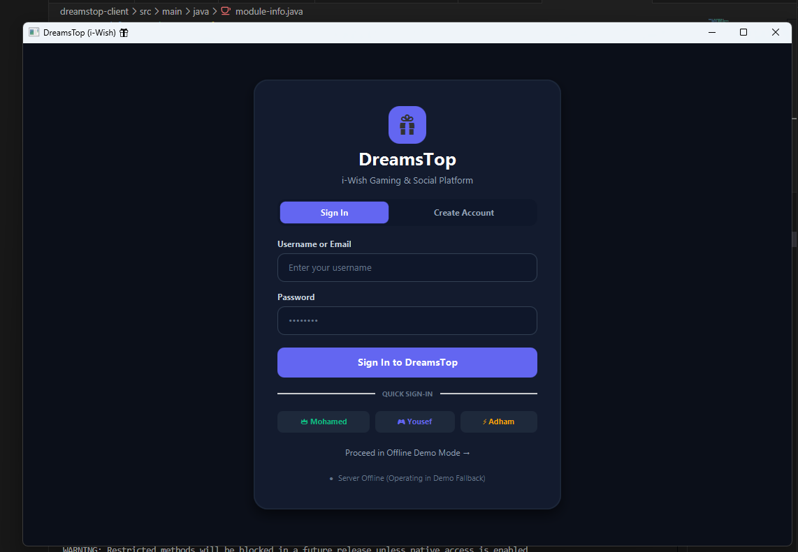
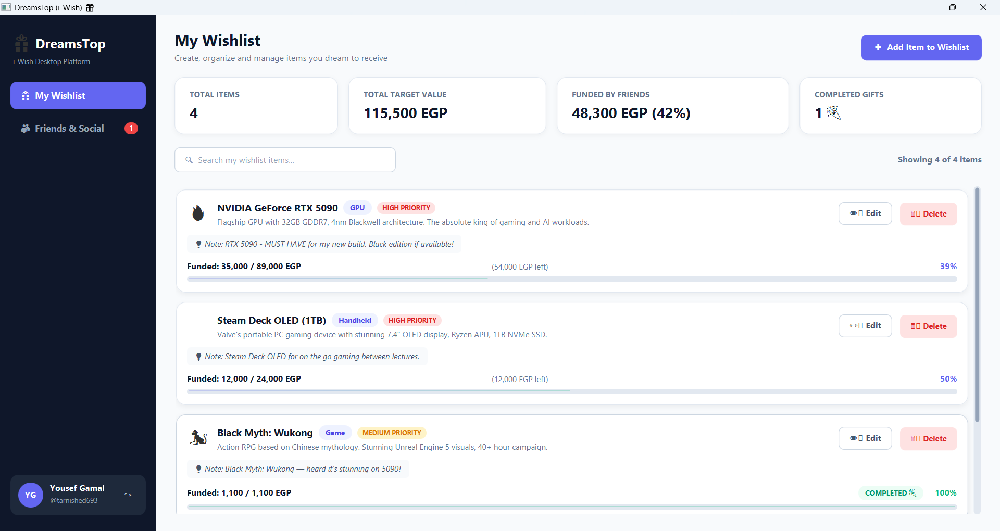
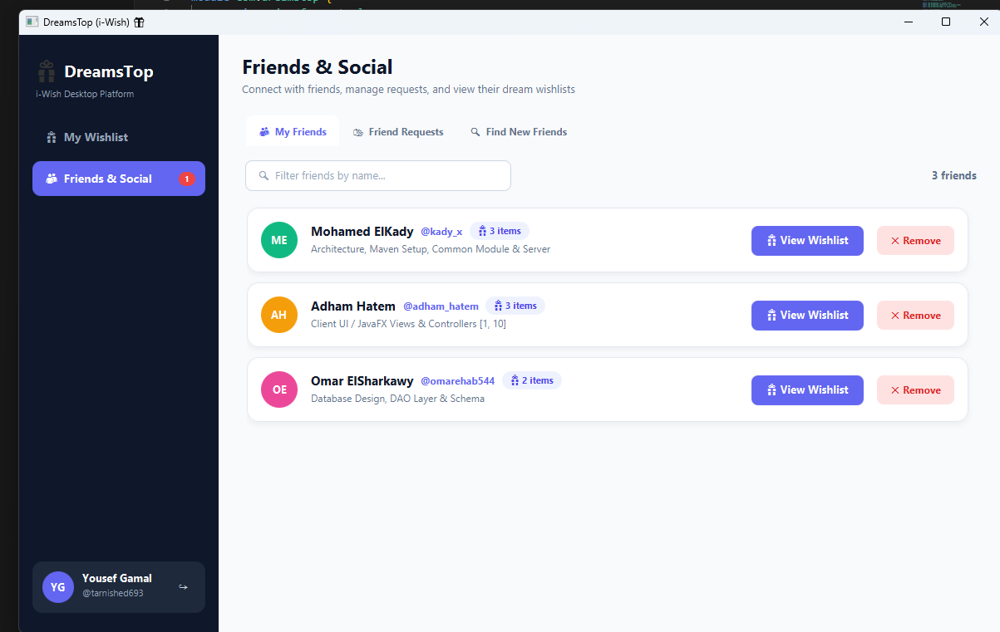
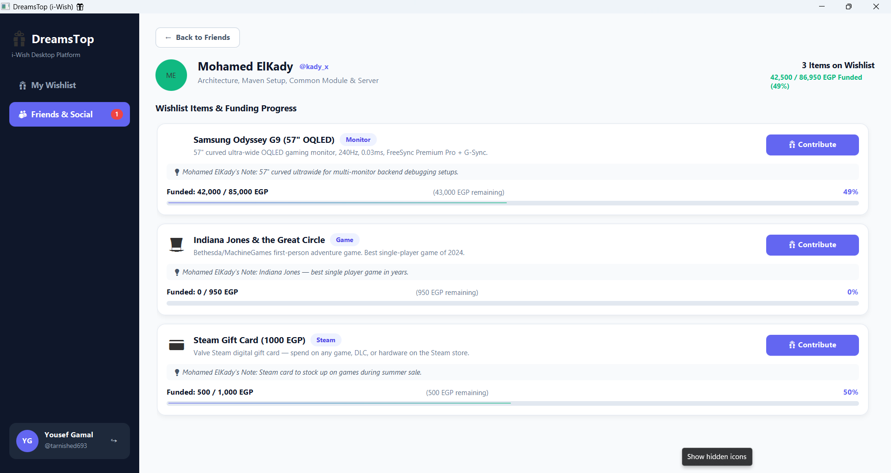
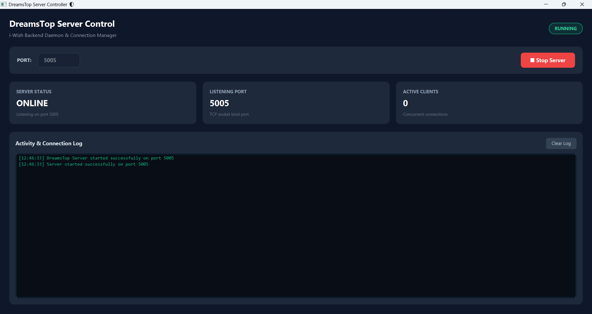
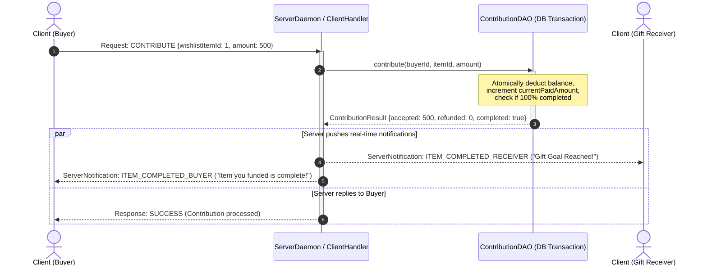

# DreamsTop (i-Wish) 🎁

[](https://openjdk.org/)
[](https://openjfx.io/)
[](https://maven.apache.org/)
[](https://www.mysql.com/)
[](https://www.h2database.com/)
[](#-automated-testing)
[](CHANGELOG.md)
[](LICENSE)

> **ITI - Building Java Desktop Applications (Orange Belt Final Project)**  
> **DreamsTop** is an enterprise-grade client-server desktop application inspired by the **i-Wish** specification. Users can create personal wishlists, connect with friends, contribute money towards purchasing items for one another, and receive **instant push notifications** upon gift completion.

---

## 📋 Table of Contents
- [DreamsTop (i-Wish) 🎁](#dreamstop-i-wish-)
  - [📋 Table of Contents](#-table-of-contents)
  - [✨ Key Highlights](#-key-highlights)
  - [📸 Visual Tour \& Demo Gallery](#-visual-tour--demo-gallery)
  - [🏗 Architecture \& Communication Protocol](#-architecture--communication-protocol)
    - [System Components](#system-components)
    - [Protocol Sequence Diagram (Contribution \& Push Notification)](#protocol-sequence-diagram-contribution--push-notification)
  - [🎯 ITI Functional Specifications](#-iti-functional-specifications)
    - [Client Application (Tasks 1–10)](#client-application-tasks-110)
    - [Server Application (Tasks 11–14)](#server-application-tasks-1114)
  - [🚀 Quick Start \& Execution](#-quick-start--execution)
    - [Prerequisites](#prerequisites)
    - [1. Clone \& Build the Project](#1-clone--build-the-project)
    - [2. Run the Server Application](#2-run-the-server-application)
    - [3. Run the Client Application](#3-run-the-client-application)
  - [🔑 Preloaded Test Accounts](#-preloaded-test-accounts)
  - [🧪 Automated Testing](#-automated-testing)
  - [👥 Team Members \& Contribution Matrix](#-team-members--contribution-matrix)
  - [🤝 Git Workflow](#-git-workflow)
  - [📄 License](#-license)

---

## ✨ Key Highlights

- **Multi-Module Maven Architecture**: Cleanly separated into `dreamstop-parent`, `dreamstop-common`, `dreamstop-client`, and `dreamstop-server`.
- **Zero-Config Database Fallback**: Auto-connects to MySQL if running, or falls back automatically to an **embedded in-memory H2 database** pre-seeded with catalog items, users, friendships, and wishlists.
- **Real-Time Push Notifications**: Bidirectional TCP socket communication delivering instant alerts to buyers and receivers when goals are met.
- **Glassmorphic JavaFX UI**: Modern dark theme with CSS custom styles, smooth micro-interactions, responsive progress bars, and toast alerts.
- **Atomic Financial Contributions**: Thread-safe database transactions ensuring exact goal funding and automatic excess refund calculations.

---

## 📸 Visual Tour & Demo Gallery

| 01. Login & Registration View | 02. Personal Wishlist Management |
| :---: | :---: |
|  |  |
| *Modern Glassmorphism card, tabs for Sign-In & Register, and Quick-Login buttons.* | *Statistics bar (Total, Funded %, Completed), category icons, and search.* |

| 03. Friends Hub & Discovery | 04. Friend Wishlist & Real-Time Contribution |
| :---: | :---: |
|  |  |
| *Three-tab manager: Accepted Friends, Incoming/Outgoing Requests, and User Search.* | *Live funding progress, preset contribution chips, and instant excess refund preview.* |

| 05. Server Admin GUI & Console | 06. Multi-Client Real-Time Demo |
| :---: | :---: |
|  | [](docs/videos/demo.mp4) |
| *Server status toggle, active client counters, and timestamped audit logs.* | *Watch 1-2 minute walkthrough of simultaneous multi-client real-time interactions.* |

> [!NOTE]
> All visual assets are stored in the [docs/screenshots/](docs/screenshots/) and [docs/videos/](docs/videos/) folders.

---

## 🏗 Architecture & Communication Protocol

### System Components

```
dreamstop/
├── pom.xml                   # Root Parent POM (Manages versions & dependencyConvergence)
├── docs/                     # Visual assets, screenshots, and demo recordings
│   ├── screenshots/          # Application screenshots for GitHub showcase
│   └── videos/               # Video demonstration files (demo.mp4)
├── dreamstop-common/         # Shared entity models, DTOs, Enums & JsonUtils (Java 11)
├── dreamstop-server/         # TCP Socket Server daemon, DAOs, H2/MySQL manager (Java 21)
└── dreamstop-client/         # Modern JavaFX Desktop GUI application (Java 21)
```

> 📖 **Deep Dive**: For complete protocol JSON schemas, action codes, database relational constraints, and threading mechanics, read **[ARCHITECTURE.md](ARCHITECTURE.md)**.

### Protocol Sequence Diagram (Contribution & Push Notification)



---

## 🎯 ITI Functional Specifications

### Client Application (Tasks 1–10)
1. **Register / Sign-In**: Secure authentication with SHA-256 password hashing and session tokens.
2. **Add / Remove Friend**: Search discoverable users, send requests, and unfriend with confirmation alerts.
3. **Accept / Decline Friend Request**: Real-time incoming request handling with accept/decline actions and cancel option for outgoing requests.
4. **Wishlist CRUD**: Create wishlist items from catalog or custom entries, edit target price and priority, and delete items.
5. **View Friends List**: Browse accepted friends, view their bios, avatar colors, and wishlist item counts.
6. **View Friend Wishlist**: Inspect friend's wishlist with real-time percentage progress bars and funding summaries.
7. **Gift Contribution**: Contribute monetary amounts with quick presets (`+100`, `+250`, `+500`, `+1000`, `Exact Amount`) and automated refund preview.
8. **[Buyer Notification]**: Instant toast alert when a gift item you contributed to is 100% funded.
9. **[Receiver Notification]**: Instant toast alert when your wishlist item receives a contribution or is fully funded.
10. **Friendly GUI**: Premium Dark Glassmorphism interface styled with JavaFX CSS, custom dialogs, and responsive layouts.

### Server Application (Tasks 11–14)
11. **Start / Stop**: Control server daemon lifecycle via both a dedicated **JavaFX Admin GUI** and a headless **CLI Controller**.
12. **Database Manipulation**: Full JDBC connection pooling, transactional operations, and pre-seeded database scripts (`schema.sql`, `seed.sql`).
13. **Client Connection Handling**: Multi-threaded socket listeners with thread pools, active client tracking, and graceful disconnects.
14. **Request Processing**: Line-delimited UTF-8 JSON request dispatcher routing commands to dedicated handlers.

---

## 🚀 Quick Start & Execution

### Prerequisites
- **Java Development Kit (JDK) 21** or higher: `java -version`
- **Apache Maven 3.8+**: `mvn -version`
- *(Optional)* **MySQL 8.0+** (if not installed, the server automatically starts the embedded in-memory H2 database).

### 1. Clone & Build the Project
```powershell
git clone https://github.com/Alamein-International-University/DreamsTop.git
cd DreamsTop
mvn clean install -DskipTests
```

### 2. Run the Server Application
You can run the server in either **GUI** or **CLI** mode:

- **Option A: Server Admin GUI (Recommended)**
  ```powershell
  mvn -pl dreamstop-server javafx:run
  ```
- **Option B: Server Headless CLI**
  ```powershell
  mvn -pl dreamstop-server compile exec:java
  ```

### 3. Run the Client Application
Launch one or more desktop clients in separate terminals:
```powershell
mvn -pl dreamstop-client javafx:run
```

---

## 🔑 Preloaded Test Accounts

The database comes pre-seeded with 6 accounts (Default password for all accounts: **`password123`**):

| Username | Full Name | Initial Balance | Preloaded Items |
| :--- | :--- | :--- | :--- |
| **`kady_x`** | Mohamed ElKady | 75,000 EGP | Samsung Odyssey G9, Indiana Jones, Steam Card |
| **`tarnished693`** | Yousef Gamal | 50,000 EGP | RTX 5090, Steam Deck OLED, Black Myth: Wukong |
| **`adham_hatem`** | Adham Hatem | 60,000 EGP | PS5 Pro, Elden Ring, Razer DeathAdder V3 |
| **`omarehab544`** | Omar ElSharkawy | 80,000 EGP | RTX 5080, Cyberpunk 2077 |
| **`ohmarha5554`** | Omar Hany | 65,000 EGP | Nintendo Switch 2, Helldivers 2 |
| **`abdullah_s`** | Abdullah Salah | 55,000 EGP | Xbox Series X, SteelSeries Arctis Nova Pro |

> [!TIP]
> The login screen contains **Quick Login** chips for `kady_x`, `tarnished693`, and `adham_hatem` to enable one-click testing!

---

## 🧪 Automated Testing

DreamsTop includes a comprehensive unit and integration test suite with **24 automated tests** covering network protocols, DAOs, handlers, and concurrency:

```powershell
mvn clean test
```

```text
[INFO] Reactor Summary for dreamstop-parent 0.1:
[INFO] dreamstop-parent ................................... SUCCESS
[INFO] dreamstop-common ................................... SUCCESS
[INFO] dreamstop-client ................................... SUCCESS (8 tests)
[INFO] dreamstop-server ................................... SUCCESS (16 tests)
[INFO] BUILD SUCCESS
```

---

## 👥 Team Members & Contribution Matrix

| Team Member | Role & Responsibilities | Assigned ITI Tasks | GitHub |
| :--- | :--- | :---: | :--- |
| **Mohamed ElKady** | Architecture, Multi-Module Setup, Common Module, Network Client, Server Core | **Lead Architecture** | [@kady-x](https://github.com/kady-x) |
| **Adham Hatem** | Client UI / JavaFX Views, Modern CSS Glassmorphic Styling, Auth Controller | **Tasks 1, 10** | [@Adham-Hatem](https://github.com/Adham-Hatem) |
| **Omar ElSharkawy** | Database Relational Schema DDL, DAO Layer Architecture, DAO Test Suite | **Task 12** | [@omarehab544](https://github.com/omarehab544) |
| **Omar Hany** | Database Connection Management, Transactions, H2 Fallback & Script Execution | **Tasks 11, 12** | [@ohmarha5554-spec](https://github.com/ohmarha5554-spec) |
| **Yousef Gamal** | Client UI / Wishlist & Friends Views, Progress Bars, Contribution Dialogs | **Tasks 2–6, 7** | [@tarnished693-max](https://github.com/tarnished693-max) |
| **Abdullah Salah** | Server Client Connections, Multi-Threading, Request Dispatcher & Handlers | **Tasks 13, 14** | [@AbdullahSalah3](https://github.com/AbdullahSalah3) |

---

## 🤝 Git Workflow

Direct pushing to the `main` branch is **restricted**. All contributions follow standard feature branching:
```powershell
git checkout -b feature/your-feature-name
# Make your changes
git commit -m "feat(scope): descriptive commit message"
git push origin feature/your-feature-name
# Open Pull Request on GitHub
```
See [CONTRIBUTING.md](CONTRIBUTING.md) for full branch rules and PR conventions.

---

## 📄 License
This project is developed for educational purposes under the ITI Java Desktop Applications Track and licensed under the [GNU General Public License version 3 (GPLv3)](LICENSE).